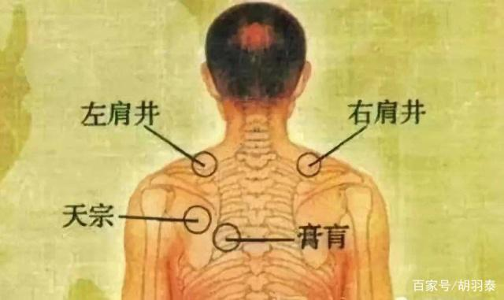
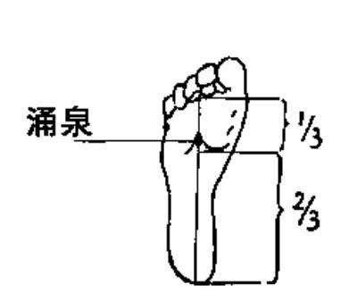
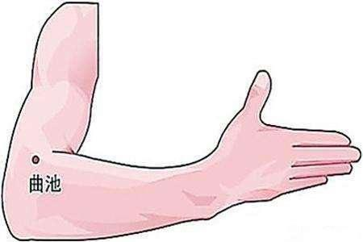
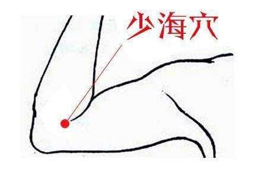
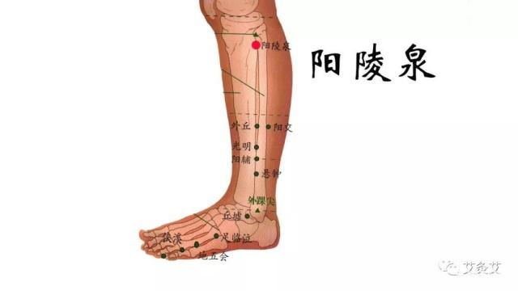
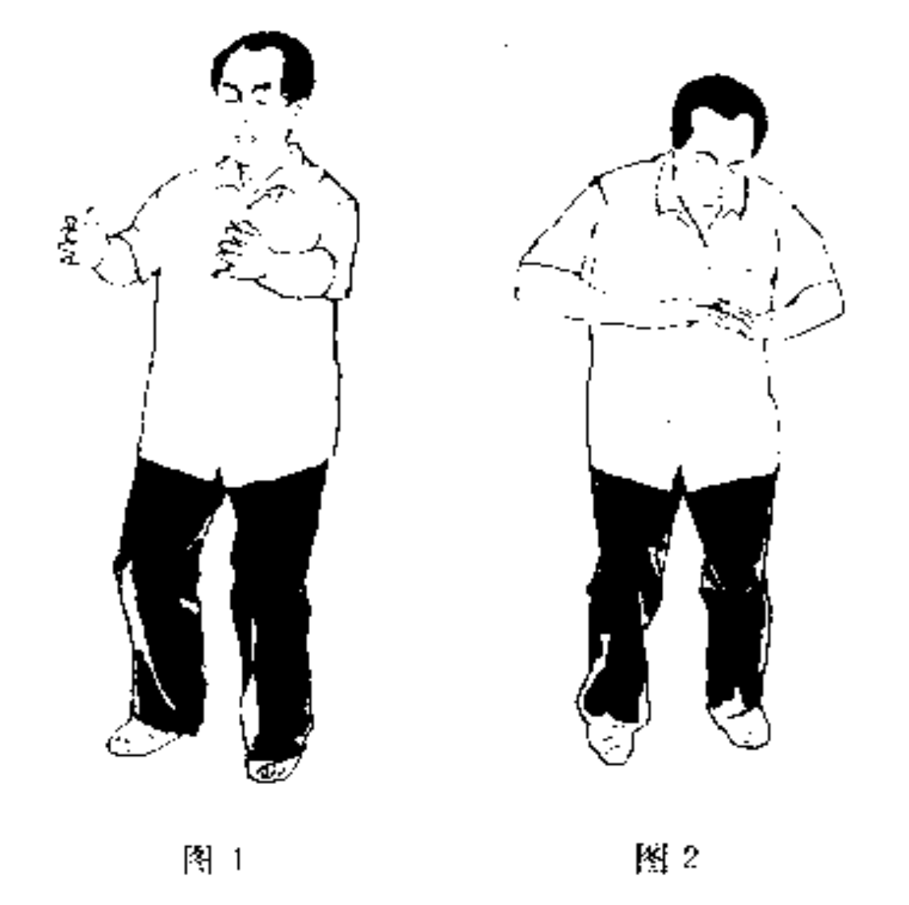

《西游记》里，猪八戒的兵器九齿钉钯是九个齿的，“九齿钉钯贯气功”就能检查出自身有没有疾病。

人一生下来就有两只手，每只手有五个手指，相当于十齿。五个手指代表一个人的五脏。从大拇指数起，大指代表肺，食指代表脾，中指代表心包经，无名指代表三焦、肝脏，小指代表肾。

什么叫“九齿钉钯贯气功”呢？就是人站起来往下蹲，同时两手伸直对正，手指头就会发胀，如果有一个手指气最微弱，说明你相关的内脏有病。

## 功法：

两脚分开与肩同宽，想一想肩井穴，先想一下左肩井与左脚心的涌泉穴，等左肩井同左涌泉垂直了，才想右肩井与右涌泉，反复三次，慢慢两脚与两肩就成一条垂直线了。

为什么两脚要与肩同宽呢？因为肩井是井口，涌泉是水源，井口必须对准水源，体内之气オ能上来，不对准穴道，气就上不来。这个动作属于基本要领，要求练功的人明白其中的功理，达到动作的要求，收效才快。

脚与肩成垂直线后，松肩坠肘。松肩坠肘这个动作也是许多功法的基本要领，因为肩、肘、腕这三个部位有密切的连带关系，即“肩松气到肘，肘坠气到手，手心一空，气才能到指梢”之理。如何“松肩”？想一想肩井穴，肩就松了。如何“坠肘”？从手的外侧绕个圏，想一下曲池穴到少海穴，肘尖就会有下坠之意，就可坠肘了。

掌握上述两个动作要领后，两手抬起，手心相对后伸直，两膝一屈，两手也微微屈了，这时就会感到手指头发胀。如果手指不发胀，练功者可两脚往下蹲一蹲，上下来回蹲，你感到蹲到哪个程度手指发胀了就是准确的位置。

体弱的人，不一定一蹲手指就发胀，上下来回几次试验，慢慢找，什么时候感到蹲的姿势手指最麻最胀，那就是准确的位置。手指发胀了，自己体会一下十个手指中哪个手指的气最微弱，就能检查出你体内哪个部位有病。比如，你觉得大指气最微弱，说明肺部有病。如果你感到食指气微，说明大肠和脾脏有病。如果中指气微，是心脏部位有病。无名指气微，是肝脏部位有病。小指气微，是肾有病。根据疾病所在的脏腑，并分别其虚实寒热，选练相应的气功功法，进行治疗。

## 收功：

把两手收起来，食指相接，眼看食指。中指相接，眼看中指。大指相接，眼看大指。两手收到鼻尖下，然后松右肩，坠右肘，收左脚，两脚靠拢。松脚腕、松膝、松胯、身体立直，眼神逐渐离开手指。以上系列动作叫收功，实际上是开后三关和前三田。

松肩坠肘，两手自动分开，意念在手心，气存丹田，再静一静，两手放在身体外侧。松胯、想环跳穴，往脚后跟上坐。意念提膝（想阳陵泉穴），感到膝盖有向上升起之感。最后想想两手、两肘、两肩、两胯、两膝、两足，就可以任意散步了。

验案：

做本功法，一般人多是感到一个手指气微，但也有同时两个手指都感到气微的。一次，我教一位朋友练这个九齿钉钯贯气功，问他感到如何，他说小指气最微，食指气也微弱一些。

我说他肾脏有病，脾也有些问题。他点点头说：“对极了，我就是肾虚，这几天脾胃不好，不想吃东西。”对本功法很感兴趣。

如果十个手指头全都发胀，说明身体没有病。我70多岁了，从来没生过病，身体很好，每次做这个功法检查时，十指都是发胀的。

