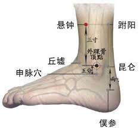

# 狮子摇头滚珠丹功

### 悬钟/绝骨/髓会穴
这个穴位有多个名字。

* 悬钟。悬，吊挂也，指空中。钟，古指编钟，为一种乐器，其声混厚响亮。该穴名意指胆经上部经脉的下行经水在此飞落而下。本穴物质为胆经上部经脉下行而至的地部经水，至本穴后经水由上飞落而下，如瀑布发出巨响一般，故名。

* 绝骨。绝，断绝、穷尽也。骨，水也。绝骨名意指胆经上部经脉的下行经水在此全部化为天部的水湿之气。本穴物质为胆经上部经脉下行而至的地部经水，至本穴后，由于本穴以下的人体组织为内收之状，经水从上部飞落而下则悬落于天部，自本穴起则无经水交于下部诸穴，故名绝骨。
* 髓会。髓，骨髓也，骨之精也，此指肾气。会，交会也。髓会名意指胆经的寒冷水气在此交会。本穴物质为胆经上部经脉下行而至的地部经水，至本穴后经水全部化为了天部的寒冷水气，本穴如同胆经寒冷之气的聚集之地，故名髓会。