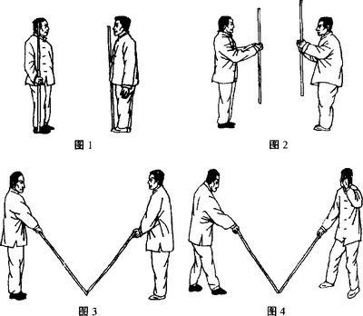

## 预备式一
甲、乙相向而立，黑鞋者为（甲）
甲在西方, 面向东；
乙在东方，面向西。
甲、乙相距两棍之长。
分别右手持棍竖于右足右前三寸左右，双足并齐。（图1)

## 预备式二
双方行抱棍礼：右手提棍胸前对准鼻尖，左掌四指根节搭于右拳骨面隆起处竖直，（表示四海武林朋友在上，间有请 教之意）大拇指回屈，（表示自谦）此时双手持棍距胸近尺。
甲乙行注目礼后说声“请”。（图2)

## 甲、乙：扬手起势

双方右手棍上举，左手接住棍尾，右手松把徐徐下滑至左手握把之上，下滑当中边滑边将棍落于面前，棍头着地，两棍棍头 概汁。（图3)

接着共退左足成右弓马步，同时左手离棍向左后 上扬，停于左额上方。目前视。（图4)

<http://www.wushupeixunban.com/spanyangshitaijiquanxiejicuispan_175886.html>

