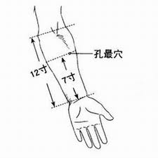
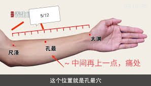
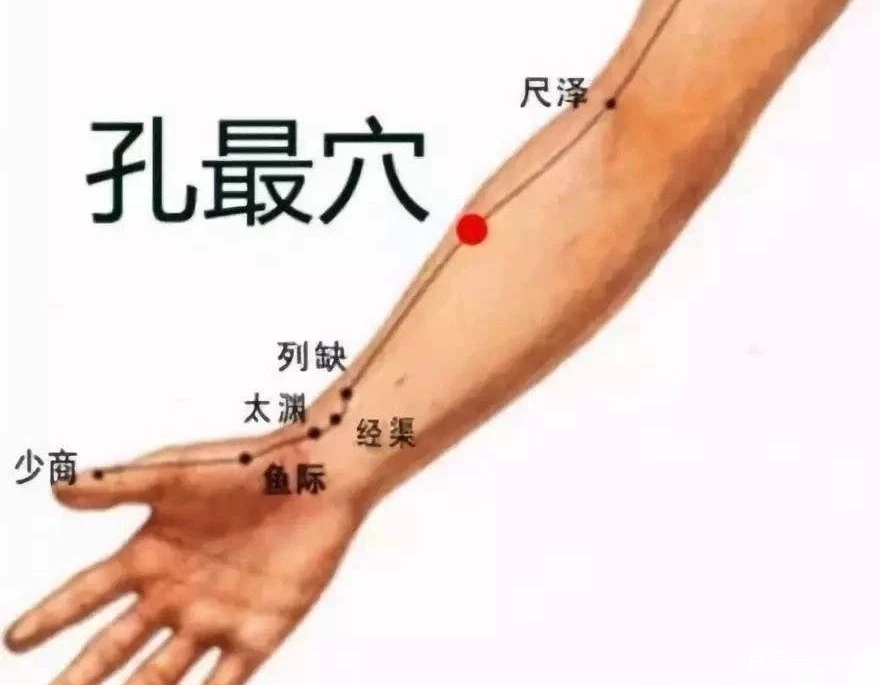

孔，孔隙也；最，多也，甚也，聚也。
孔最穴属于手太阴肺经，是该经郄穴，为本经气血深聚之处，是理血通窍最得用之穴位，故取名孔最穴。

最，多也。 本穴为肺经之穴，肺之时序应秋，其性燥，肺经所过之处其土(肌肉)亦燥(肺经之地为西方之地)，尺泽穴流来的地部经水大部分渗透漏入脾土之中，脾土在承运地部的经水时如过筛一般，故名孔最。

孔最穴是手太阴肺经上的一个重要穴位，位于前臂掌面桡侧，尺泽穴与太渊穴连线上，腕横纹上7寸。

由于脑力劳动者长时间坐着从事脑力工作，运动的机会相当少，非常容易患痔疮，经常按压孔最穴不仅可以缓解痔疮的疼痛，也可以凋理肺气，清热凉血。

