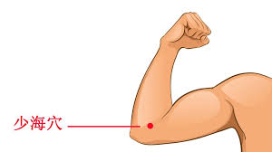

少海

少，幼小之意，为手少阴心经；
海，海洋，表此为合穴。

## 曲池找少海
* 最直观的解剖位置上看，“曲池找少海”就是要求 **将肘关节的外侧向内收，去靠近或对准肘关节的内侧**。
* 这个口诀的核心目的是为了纠正一个常见的错误姿势——**“扬肘”或“抬肘”**，从而形成正确的“沉肩坠肘”姿态。

https://chat.deepseek.com/a/chat/s/26c95367-d95b-4279-954a-801db1d63854
