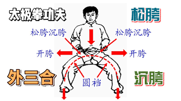

开胯的目的是盘开胯根至膝弯的大筋，借从而产生自动的皮筋般弹射劲力，练助肩胯的反拧对拔，将“大筋”拉伸，习一段时间后达到胯自动“崩弹”的效果。

圆裆开胯的要领：两肩找两腰，两腰找两胯

胯开不是胯岔、胯撇、两腿岔开越大越好，要求的是内开而不是两腿外形的撇、岔。“裆开不在大小，即一丝之微亦算得开。心意一开，裆即开矣。腿虽岔三尺宽，不开仍然不开”。

裆是指会阴部分和两大腿根内側

开胯要沉中开，转胯要沉中转，托胯腰沉中托，扣胯要沉中扣，挺胯要沉中挺，坐胯要沉中坐。腰与胯在生理上是有关联的，如先松腰再松胯就有可能引起腰塌压死胯。
