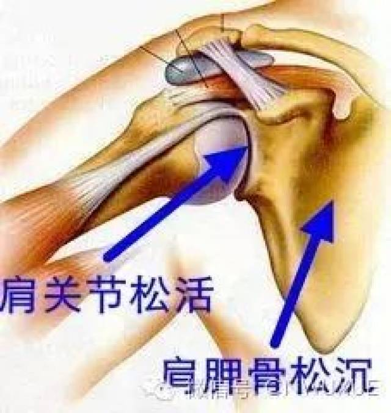
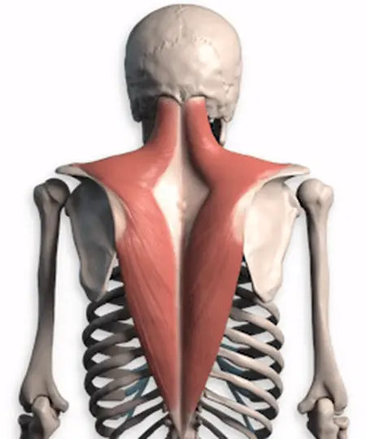
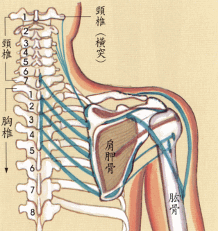

当手臂拉出去的时候，肩井的窝会往下深陷的更多，这样看窝的深浅就知道自己的肩松的情况了。

松肩必须空腋，当肩往下松时腋是空的、虚的，不要夹着膈肢窝，肩胛骨往外撇一点，同时略向前移，就是肩膀上的骨尖微微外开并前送，稍微一转。

松是要求,而沉则是松的程度显现,也就是松的境地,是松后自然形成的。

在太极拳的走架中，手（上肢）不可以自动做出动作，在完全放松的状态下，它全靠身腰来引动。所以有“太极拳不动手，动手非太极”之说。

要做到这点，关键在于松开肩关节，在意念的引导下，让臂与肩象松脱开了似的，这样，当身腰转动时，让转动所产生的离心力去牵动手旋转；当身下沉时，让地心吸引力去引动手沉降；当身腰前进或后退时，让前进或后退的惯性带动手的向前或移后；如此等等，需要提一下的是；在这个过程中，尚应借助地对脚的反坐力，让这个反坐力由脚而腿而腰传递而手。

##肩胛骨

肩胛骨是肩的根基。要想沉肩，先得松肩。要想松肩，先得把肩胛骨摆平了。说摆平了是比喻，恰当地说法是摆竖了，摆顺溜了。摆竖了，摆顺溜了，有一个标准，就是垂直方向上不挂力。做法是：把肩胛骨向后、向外拉开。主要是用意，也可以多多少少用点儿力。如果是借呼吸之力撑开，最好。

肱骨是吊在肩胛骨的角上的。这个关节上有肌肉筋膜，肌肉放松，筋膜膨胀，肱骨就“挂”上了。要想挂得好，肘得垂。沉肩得垂肘，垂肘可沉肩。

先把肱骨头儿向肩胛骨靠拢一下，然后在向外拉开，熟了之后，意念一想肩井穴（忘掉肩关节），肩就会自然松开，就像人睡着了把自身忘了，全身也就松开了一样。肩井穴在哪儿呢？双手交叉搭到肩上，中指肚儿的位置即是。

其实肩要是没了，就不存在僵硬了，如此则不如想象把双肩卸下来安装到两个腰子（肾）上，既松了肩有可用上腰力，武谚云：“手从腰出，力大如牛”，理正在此。

