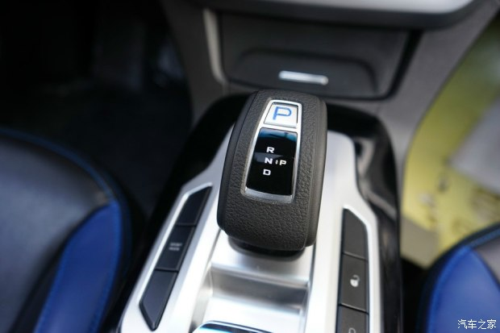

“钢+皮”复合材质构成的换挡杆，采用顺序式换挡设定。

+ 向前推进入R挡、
+ 向后拉进入D挡，
+ 档位自默认为N挡，
+ 每次换挡都会自动恢复默认位置，
+ 向下按“P”就可进入P挡。

电子手制动系统在换档面板后部（下按锁定/上垃解锁）。

帝豪EV电动汽车全系标配了电子手制动系统，只要佩戴好安全带从P挡-D挡，或从N挡至D挡，即便电子手制动系统开启，只要稍“点”下“油门”踏板，即可正常行驶。

